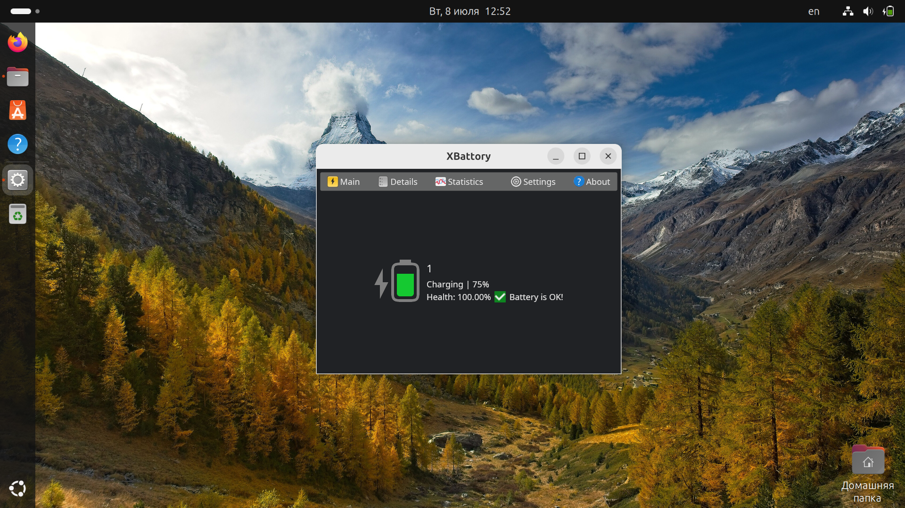

# xbattory

xbattory is a simple and lightweight utility to get information about notebook's battery on Linux. It reads and parses `/sys/class/power_supply/BAT<X>/uevent` file and draws beautiful UI with information from him.

## Features

- 3 pages: "Main page", "Details" and "Power statistics";
- Simple user interface;
- Crossplatform: you can run xbattory on many Linux distributions;
- i18n support via `fluent`;
- Written in Rust :)

## Installation

1. Go to the "Releases" page;
2. Download the latest *stable* AppImage package of `xbattory`;
3. Make this executable;
4. Run it!

## License

`xbattory` is distributed under the [MIT license](LICENSE).
